# KitScore

A WordPress portfolio project built to demonstrate end-to-end product data integration, custom theme development, and UX design on WordPress. The platform aggregates 465 real Decathlon sports equipment products across 15 categories and presents them through a score-based review system, side-by-side comparison, customer reviews, and a dark-themed responsive interface.

---

## Screenshots

### Homepage
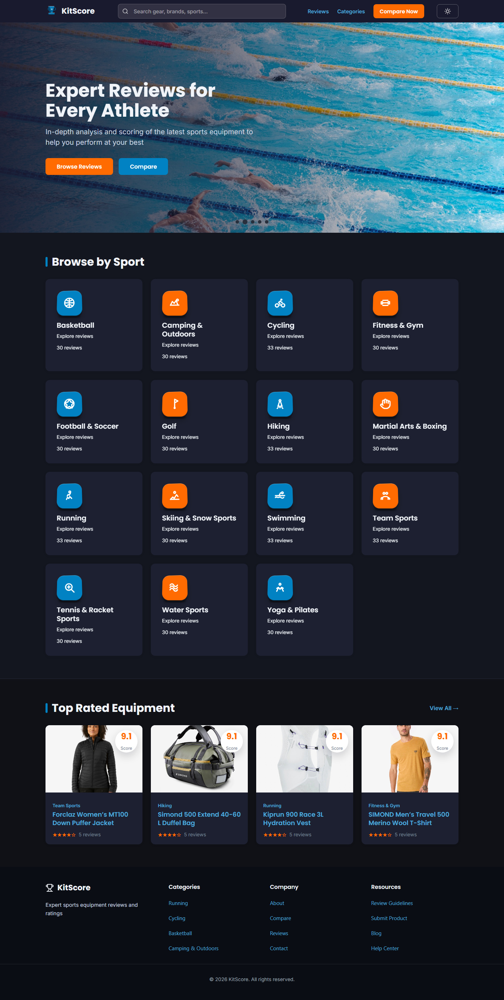

### Category Grid
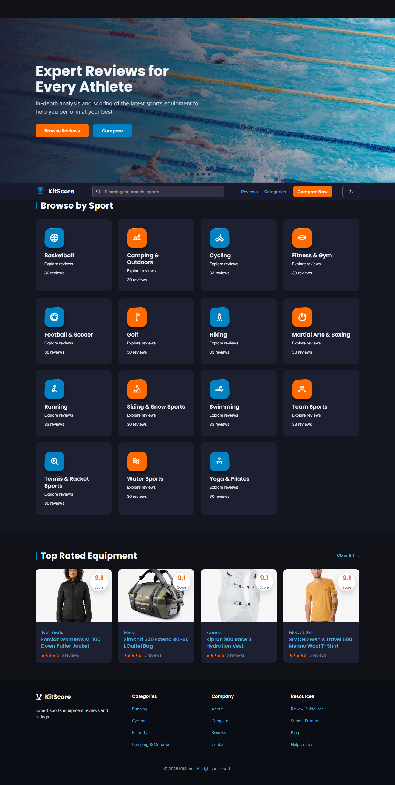

### Top Rated Equipment
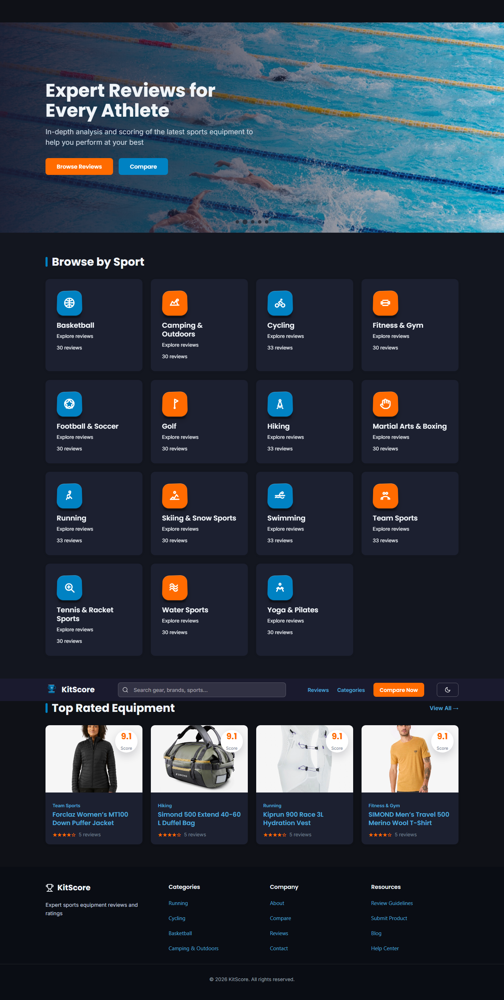

### Category Archive — Hiking
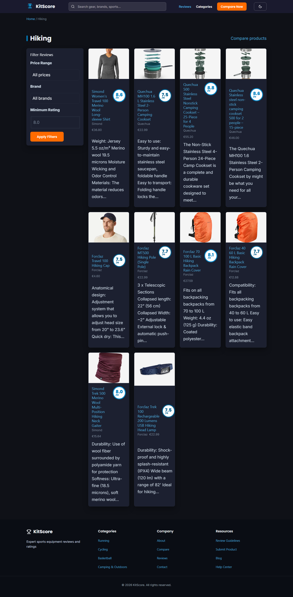

### Category Archive — Running
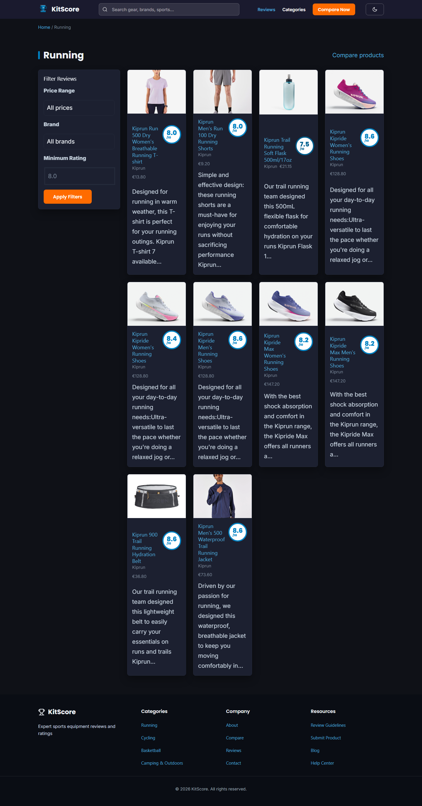

### Single Product Page
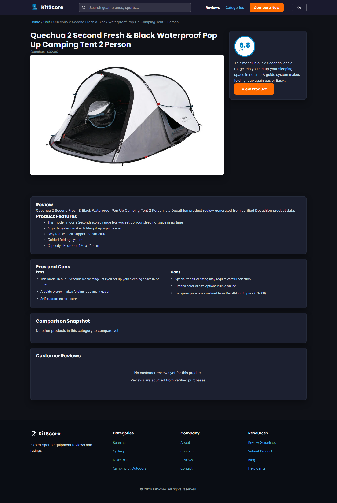

### Comparison Snapshot
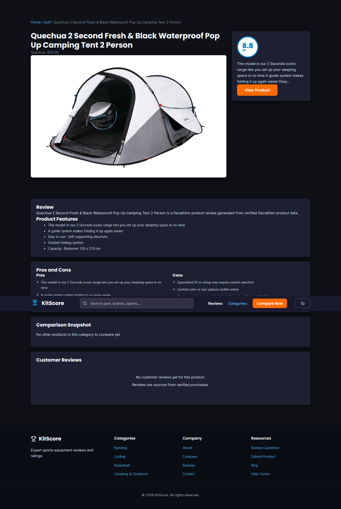

### Customer Reviews Section

### Compare Page
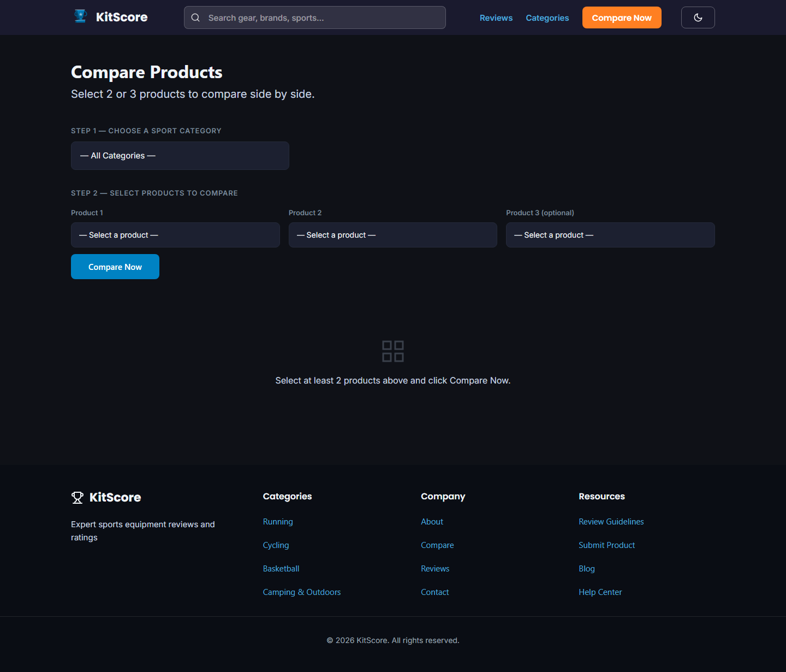

### Product Reviews Page
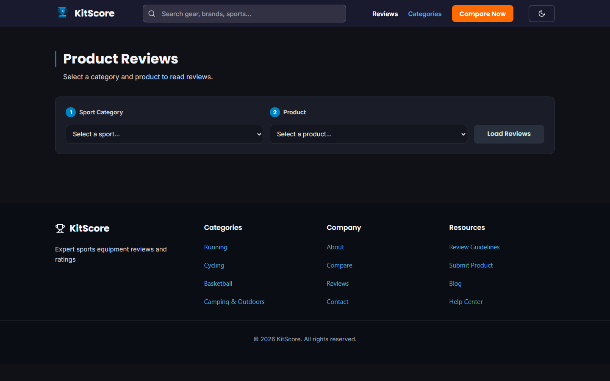

### Reviews Loaded
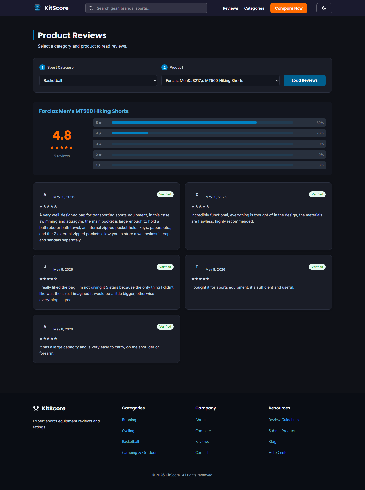

### Navigation Flow — Category to Product
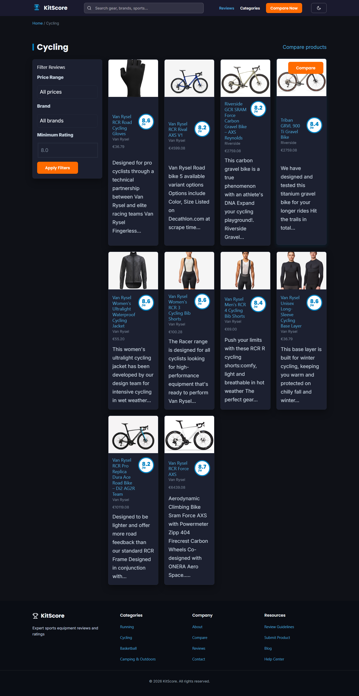
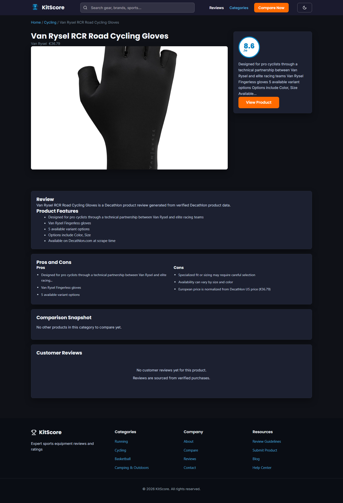

---

## Dataset

All product data is real and sourced from publicly available information on decathlon.com. No placeholder or generated content was used anywhere in this project.

**Source:** decathlon.com product catalog
**Import method:** Python scraper using requests and BeautifulSoup, inserted via WP-CLI batch commands
**Total products:** 465 published entries
**Categories:** 15 sport categories

| Category | Products |
|---|---|
| Running | 33 |
| Cycling | 33 |
| Swimming | 33 |
| Hiking | 33 |
| Team Sports | 33 |
| Fitness and Gym | 30 |
| Yoga and Pilates | 30 |
| Tennis and Racket Sports | 30 |
| Basketball | 30 |
| Football and Soccer | 30 |
| Skiing and Snow Sports | 30 |
| Water Sports | 30 |
| Camping and Outdoors | 30 |
| Martial Arts and Boxing | 30 |
| Golf | 30 |

Each product entry stores: product name, brand, price in EUR, description, features list, pros, cons, score (0-10), product image URL, and a direct link to the Decathlon product page.

---

## Page Structure

### Homepage

The homepage is built as a front-page.php template with four distinct sections.

**Hero section** — A full-viewport image slideshow cycling through five sport category photographs every 4 seconds with a crossfade transition. Dot indicators at the bottom allow manual navigation. The hero overlay gradient ensures text legibility regardless of which image is active. Two CTAs link to the reviews archive and the compare page.

**Browse by Sport** — A responsive grid of 15 sport category cards. Each card shows a sport-specific SVG icon rendered with CSS 3D depth using `perspective`, `rotateX`, and layered `box-shadow` to simulate a physical badge. Hovering a card lifts it with `translateY` and increases the shadow. Clicking navigates to the filtered product archive for that category.

**Top Rated Equipment** — A dynamic grid of the four highest-scoring products pulled via WP_Query ordered by the `score` ACF meta field. Each card shows the product image from Decathlon, brand, price, score badge, star rating, and a Read Review link.

**How It Works** — A three-step explainer section with SVG icons for We Test, We Score, and You Choose.

### Category Archive

Template: `archive-product_review.php` and `taxonomy-sport_category.php`

Each sport category has its own archive page accessible at `/sport/[category-slug]/`. The archive displays all products in that category with sidebar filters for price range, brand, and minimum rating. Products are ordered by score descending by default. A filter panel on the left allows narrowing results without page reload using AJAX.

### Single Product Page

Template: `single-product_review.php`

Two-column layout. Left column contains the product image and written content. Right column contains a sticky score badge card with the numeric score, color-coded by threshold (green for 8+, orange for 6-7, red below 6), a short description excerpt, and a View Product button linking to the original Decathlon page.

Below the image: a features list pulled from the `features` ACF field, a pros and cons two-column layout, and the Comparison Snapshot table.

**Comparison Snapshot** — A dynamically generated comparison table showing the current product alongside two other products from the exact same sport category, selected by highest score. The tax_query filters strictly by the current post's `sport_category` taxonomy terms so a hiking backpack is never compared with a running vest.

**Customer Reviews** — Pulls from two sources: an ACF repeater field `user_reviews` storing reviewer name, rating, date, review text, and verified status, and WordPress native comments as a fallback. Cards with empty review text are skipped at the data layer. A rating distribution summary card at the top shows average score, total count, and a percentage bar for each star level.

### Compare Page

Template: `page-compare.php`

A two-step selector: first choose a sport category from a dropdown, then choose two or three products from that category. The product dropdown is filtered via AJAX to only show products from the selected category. On clicking Compare Now the page reloads with URL parameters and renders a structured table comparing: score badges, brand, price, best-for description, pros list, cons list, and a View on Decathlon link per product.

### Product Reviews Page

Template: `page-reviews.php`

Step 1 selects a sport category. Step 2 selects a product from that category loaded via AJAX. Clicking Load Reviews renders a summary card with average rating, total count, and star distribution bars, followed by individual review cards in a two-column grid. Each review shows: reviewer initials circle, name, star rating, date, verified badge, and full review text. Clicking a star row in the distribution bars filters the visible review cards to that rating instantly via JavaScript with a count label showing how many reviews match.

---

## Technical Stack

| Layer | Technology |
|---|---|
| CMS | WordPress 7.0 |
| Language | PHP 8.2 |
| Custom fields | Advanced Custom Fields |
| Theme base | Twenty Twenty-One child theme |
| Styling | Custom CSS with CSS variables and dark mode |
| Interactivity | Vanilla JavaScript, WordPress AJAX |
| Local development | LocalWP |
| Screenshot automation | Playwright (Node.js) |
| Data import | WP-CLI batch insert from scraped CSV |

---

## Dark Mode

Dark mode is implemented as a CSS class toggle on the `<body>` element. Clicking the toggle button in the navigation adds or removes the `dark-mode` class and saves the preference to `localStorage`. On page load a small inline script reads `localStorage` before paint to apply the class immediately and avoid a flash of light mode. All color values use CSS custom properties so a single class change cascades through the entire interface.

---

## Local Setup

1. Install LocalWP and create a site named `kitscore`
2. Copy this theme folder to `wp-content/themes/`
3. Install and activate the Advanced Custom Fields plugin
4. Activate the KitScore Child theme
5. Go to Settings > Permalinks, select Post name, and save to register custom post type URLs
6. Import product data via WP-CLI using a CSV export from the scraper

The database is not included in this repository. After setup the site will be empty until product data is imported.

---

## Data Attribution

This project is independent and not affiliated with, sponsored by, or endorsed by Decathlon. Product data was sourced from publicly available pages on decathlon.com for portfolio and educational demonstration purposes only.

---

## Author

Cemre Mete
cemremete.dev — github.com/cemremete — linkedin.com/in/cemremete
